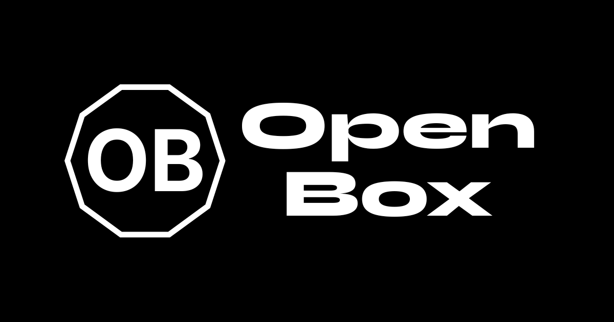
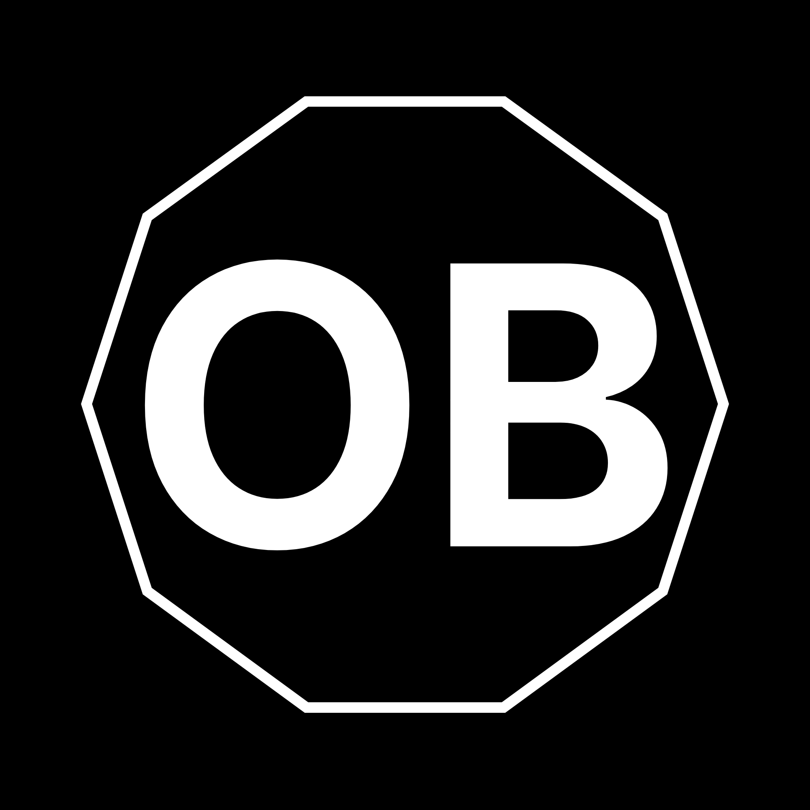
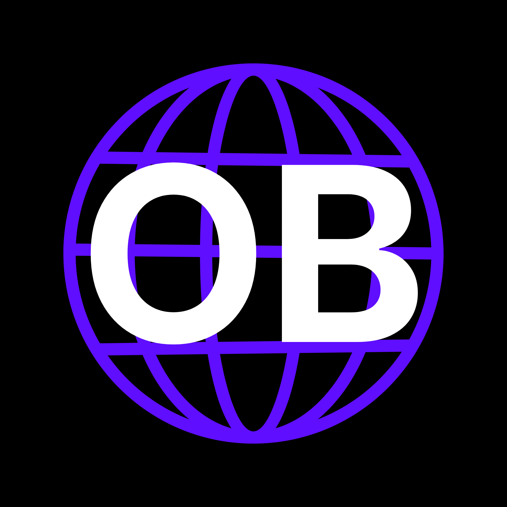
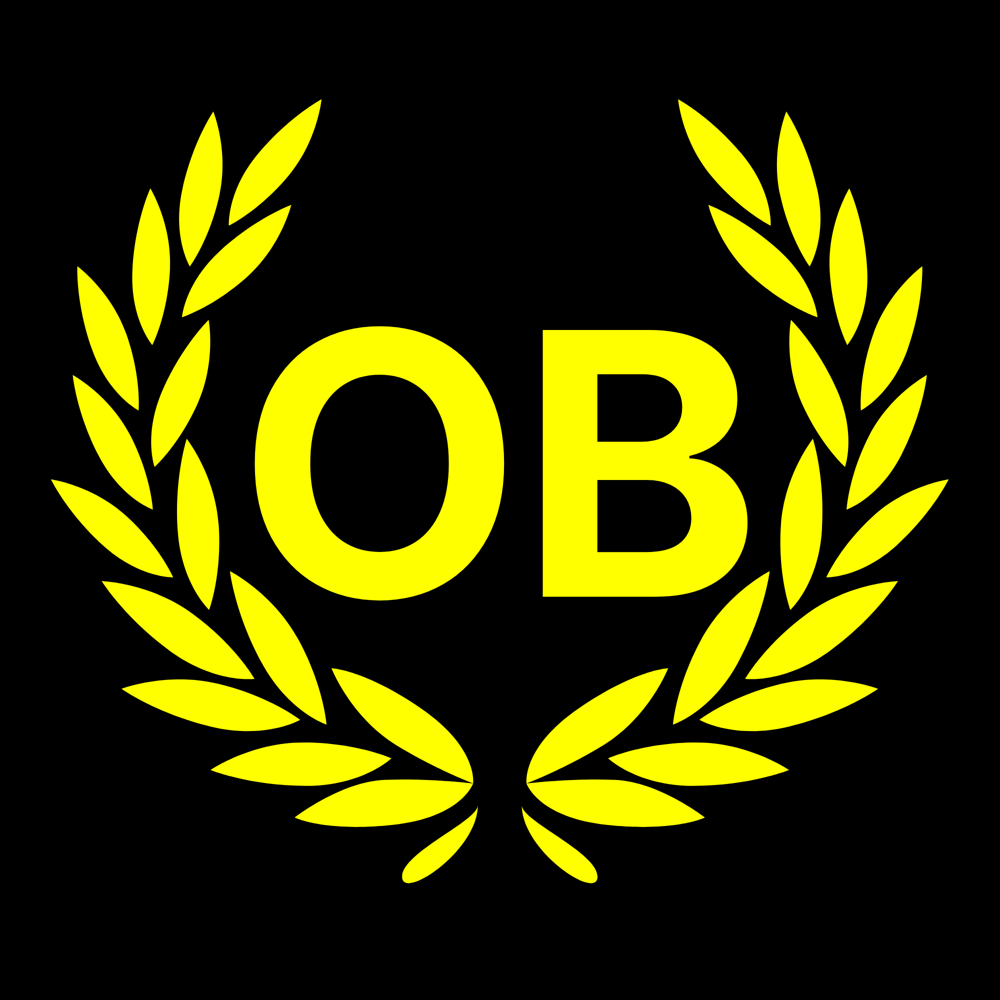

<div align="center">

# 📦 Open Box


### A modern, high-performance Discord community platform

**Built with Next.js · TypeScript · Tailwind CSS · Framer Motion · GSAP · Three.js**

[](https://www.openboxcomm.in/)
[](https://nextjs.org/)
[](https://www.typescriptlang.org/)
[](https://tailwindcss.com/)

**[Visit the Site](https://www.openboxcomm.in/)** · **[Report a Bug](mailto:support@openboxcomm.in)** · **[Request a Feature](mailto:hello@openboxcomm.in)**

</div>

---

## 📖 Table of Contents

- [Quick Start](#-quick-start)
- [Tech Stack](#-tech-stack)
- [Project Structure](#-project-structure)
- [Content Management](#-content-management)
- [Scripts](#-scripts)
- [Deployment](#-deployment)
- [Key Features](#-key-features)

---

## 🚀 Quick Start

### Installation

```bash
git clone <repo-url>
cd open-box-website-del
npm install
```

### Environment Setup

Copy `.env.local.example` to `.env.local`:

```bash
cp .env.local.example .env.local
```

Fill in the required environment variables:

```env
# Discord Server Invites
NEXT_PUBLIC_DISCORD_JN_INVITE=https://discord.gg/...
NEXT_PUBLIC_DISCORD_DEV_INVITE=https://discord.gg/...
NEXT_PUBLIC_DISCORD_GG_INVITE=https://discord.gg/...
NEXT_PUBLIC_DISCORD_INVITE_MAIN=https://discord.gg/...

# Social Links
NEXT_PUBLIC_YOUTUBE_URL=https://youtube.com/@openbox
NEXT_PUBLIC_INSTAGRAM_URL=https://instagram.com/openboxcomm
NEXT_PUBLIC_PATREON_URL=https://patreon.com/openbox
NEXT_PUBLIC_X_URL=https://x.com/openboxcomm

# Feature Flags
NEXT_PUBLIC_LOGIN_ENABLED=false
```

### Run the Dev Server

```bash
npm run dev
```

Open **[http://localhost:3000](http://localhost:3000)** and you're live.

---

## 🛠️ Tech Stack

| Category | Technology |
|---|---|
| 🧩 Framework | Next.js 16 (App Router) |
| 📘 Language | TypeScript |
| 🎨 Styling | Tailwind CSS v3, class-variance-authority, clsx, tailwind-merge |
| 🧱 UI Library | Radix UI (`@radix-ui/react-*`) + shadcn/ui |
| 📄 Content | TypeScript Objects (`lib/community-data.ts`, `lib/docs.ts`) |
| 🌗 Theme | next-themes (dark/light) |
| 🧊 3D Graphics | Three.js |
| ✨ Animations | Framer Motion + GSAP |
| 🔤 Icons | Lucide React |

---

## 📁 Project Structure

```
open-box-website-del/
├── app/                       # Next.js App Router (Pages, layouts, API routes)
│   ├── (auth)/                # Auth routes
│   ├── about/, blogs/, doc/   # Main pages
│   ├── events/, servers/      # Dynamic listings
│   └── api/                   # API endpoints
├── components/                # Reusable UI components
│   ├── ui/                    # shadcn/ui components
│   └── ...                    # Navbar, Footer, Quiz, MasterCalendar, etc.
├── lib/                       # Core logic and hardcoded data
│   ├── community-data.ts      # Data for servers, blogs, events, doc index
│   ├── docs.ts                # Documentation page contents
│   ├── constants.ts           # App constants
│   ├── seo.ts, performance.ts # Utilities
│   └── hooks/                 # Custom React hooks
├── public/                    # Static assets (images, fonts)
├── types/                     # TypeScript definitions
├── tailwind.config.ts         # Tailwind configuration
└── next.config.mjs            # Next.js configuration
```

---

## 📝 Content Management

Our content is currently managed via TypeScript objects rather than markdown/MDX files. This ensures strong typing and faster builds.

### Adding a Blog Post

Edit [`lib/community-data.ts`](./lib/community-data.ts) and add to the `blogs` array:

```ts
{
  slug: 'my-post',
  title: 'Post Title',
  server: 'OB JN',
  date: '2026-06-29',
  excerpt: 'Brief description.',
  readTime: '4 min read',
}
```

📍 View at `/blogs/my-post`

### Adding an Event

Add to the `events` array in [`lib/community-data.ts`](./lib/community-data.ts):

```ts
{
  id: 'my-event',
  name: 'Event Name',
  server: 'Dev',
  serverSlug: 'dev',
  date: '2026-08-01T18:00:00+05:30',
  description: 'Event description.',
  ticketStatus: 'free',
  isOffline: false,
  location: 'Discord',
  agenda: ['Part 1', 'Part 2'],
}
```

📍 View at `/events/my-event`

### Adding Documentation

Documentation consists of an entry in `community-data.ts` and the actual content in `docs.ts`.

1. Add the metadata to the `docs` array in [`lib/community-data.ts`](./lib/community-data.ts):

```ts
{
  slug: 'my-doc',
  title: 'My Document',
  description: 'Brief description.',
  section: 'Core',
}
```

2. Add the content to `docContents` in [`lib/docs.ts`](./lib/docs.ts):

```ts
'my-doc': {
  sections: [
    {
      title: 'Section 1',
      content: 'Your content goes here.',
    },
  ],
},
```

📍 View at `/doc/my-doc`

### Adding a Server

Edit the `servers` array in [`lib/community-data.ts`](./lib/community-data.ts):

```ts
{
  slug: 'myserver',
  name: 'OB MyServer',
  description: 'Tagline shown on card.',
  longDescription: 'Full description for detail page.',
  tags: ['tag1', 'tag2'],
  memberCount: 0,
  isLive: true,
  accent: 'from-violet-500 to-fuchsia-600',  // Tailwind gradient
  channels: ['Channel A', 'Channel B'],
  rules: ['Rule 1', 'Rule 2'],
  inviteEnv: 'NEXT_PUBLIC_DISCORD_MYSERVER_INVITE',
}
```

Add a logo at `/public/images/myserver.png`

---

## 📜 Scripts

```bash
# Development
npm run dev

# Build for Production
npm run build
npm run start

# Code quality
npm run lint
```

---

## ☁️ Deployment

> **Recommended:** Vercel, for seamless Next.js App Router integration.

### Environment Variables

All `NEXT_PUBLIC_*` variables are exposed to the browser. Keep secrets server-side only.

### Notes

- Discord widgets must be **enabled** in server settings for live member counts
- All images should be optimized (PNG/WebP) and stored in `/public/images/`

---

## ✨ Key Features

| | |
|---|---|
| 🔎 **Server Discovery** | Browse all Discord servers with live member counts |
| 📅 **Event Calendar** | Master calendar of all community events |
| ✍️ **Blog Platform** | Share updates and stories |
| 📚 **Documentation** | TypeScript-based docs system |
| 🌓 **Dark Mode** | Theme switcher with `next-themes` |
| 📈 **SEO Optimized** | Metadata, sitemap, structured data |
| 📱 **Responsive** | Mobile-first design with Tailwind CSS |
| ⚡ **Fast & Dynamic** | Framer Motion + GSAP + Three.js |
| ♿ **Accessible** | WCAG compliance with Radix UI components |

---

## 🎨 Server Logos

Here are the logos for our various Open Box servers:

<div style="display: flex; gap: 10px; flex-wrap: wrap; justify-content: center;">
  
  
  
  
  
  
  
  
  
</div>

---

<div align="center">

Made with ⚡ by the **OpenBox Team**

</div>